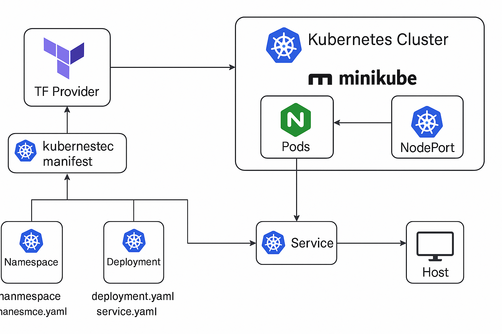
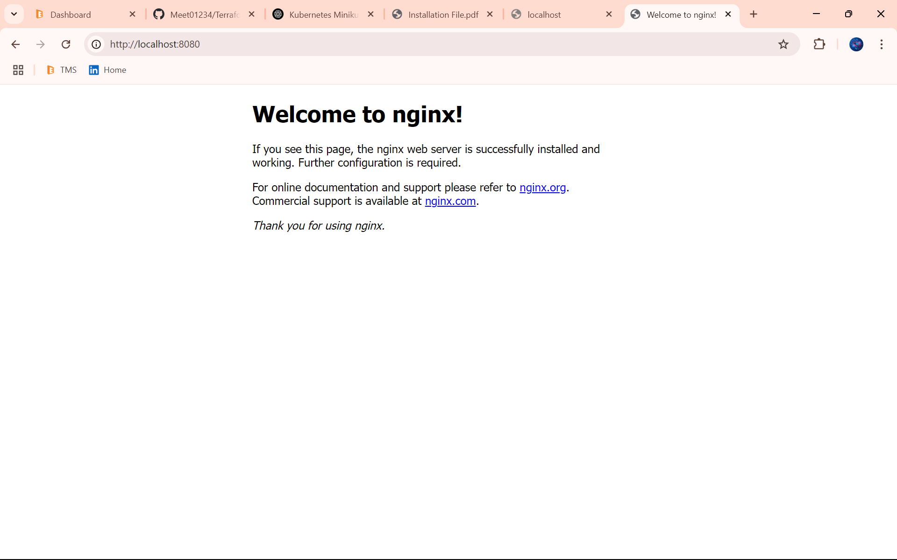

# Terraform Kubernetes Setup with Minikube (NGINX Example)



This project sets up a basic Kubernetes deployment using Terraform with Minikube as the Kubernetes cluster provider.

## ✅ Project Steps
1. Install and Configure kubectl
2. Start a Local Kubernetes Cluster with Minikube or Kind
3. Create a Namespace in Kubernetes
4. Deploy a Simple Pod Using a YAML File
5. Create a Deployment for Nginx with 2 Replicas
6. Expose the Deployment Using a Service (NodePort)
7. Scale the Deployment to 5 Replicas

---

## ✅ Project Components

1. Provision Kubernetes namespace, deployment, and service via YAML
2. Use Terraform to manage Kubernetes resources using the `kubernetes_manifest` resource
3. Run and access an NGINX application via NodePort on Minikube

---

## 📄 main.tf

```bash
notepad main.tf
```

```hcl
terraform {
  required_providers {
    kubernetes = {
      source  = "hashicorp/kubernetes"
      version = "~> 2.0"
    }
  }
}

provider "kubernetes" {
  config_path = "C:\\Users\\Meet\\.kube\\config"
}

resource "kubernetes_manifest" "namespace" {
  manifest = yamldecode(file("${path.module}/namespace.yaml"))
}

resource "kubernetes_manifest" "nginx_deployment" {
  manifest = yamldecode(file("${path.module}/deployment.yaml"))
}

resource "kubernetes_manifest" "nginx_service" {
  manifest = yamldecode(file("${path.module}/service.yaml"))
}
```

---

## 📄 namespace.yaml

```bash
notepad namespace.yaml
```

```yaml
apiVersion: v1
kind: Namespace
metadata:
  name: demo-namespace
```

---

## 📄 deployment.yaml

```bash
notepad deployment.yaml
```

```yaml
apiVersion: apps/v1
kind: Deployment
metadata:
  name: nginx-deployment
  namespace: demo-namespace
spec:
  replicas: 5
  selector:
    matchLabels:
      app: nginx
  template:
    metadata:
      labels:
        app: nginx
    spec:
      containers:
        - name: nginx
          image: nginx
          ports:
            - containerPort: 80
```

---

## 📄 service.yaml

```bash
notepad service.yaml
```

```yaml
apiVersion: v1
kind: Service
metadata:
  name: nginx-service
  namespace: demo-namespace
spec:
  selector:
    app: nginx
  type: NodePort
  ports:
    - port: 80
      targetPort: 80
      nodePort: 30080
```

---

## 📄 outputs.tf

```bash
notepad outputs.tf
```

```hcl
output "nginx_url" {
  value = "http://localhost:30080"
}
```

---

## ⚙️ Minikube Installation

```bash
choco install minikube -y
```

```bash
minikube start --driver=docker
```

Check config:

```bash
dir C:\Users\Meet\.kube\config
```

---

## 🚀 Terraform Commands

```bash
terraform init
```

```bash
terraform apply -auto-approve
```

---

## 🧪 Kubernetes Validation Commands

```bash
minikube status
```

```bash
kubectl get pods -n demo-namespace
```

```bash
kubectl get svc -n demo-namespace
```

If service is not accessible, use:

```bash
kubectl port-forward svc/nginx-service 8080:80 -n demo-namespace
```

---

Now access your NGINX site via: [http://localhost:8080](http://localhost:8080)

---

---



---
